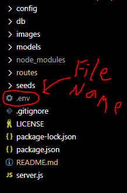
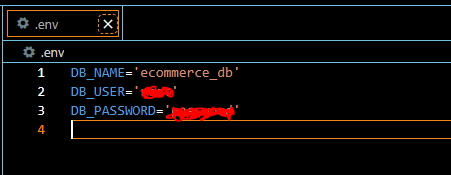

# E-commerce Backend

## Description

A backend project that utilizes Sequelize for Mysql database actions. I use the npm package sequelize to access the database on a server. Once there is access you are able to seed the database used the files located in the seeds directory. Each table for the database is defined in the models directory. It then uses express to run on the localhost and you are able to use GET, POST, PUT, and DELETE routes. Check out video to see it in action. I also use the npm package dotenv to store sensition data (see screenshots below).

 ## Installation

Make sure to have node js installed. I used the recommended version which is 20.10.0 LTS as of now. Also have mysql installed. You will also need to create a dotenv file that contains the user and password information (see screenshots below). Log into mysql and run the schema file located in the db directory. After all that, in the terminal type "npm install" and hit enter. This should install all the npm packages used. After type "npm start" and this should now be running on the localhost. Don't forget to terminate process once you are done. Use ctrl c to exit.

Link to node js: https://nodejs.org/en/
Link to mysql: https://www.mysql.com/

## Screenshots

### Setting up dot env file

File should be named ".env"

These are the contents of the file. DB_USER can be found by running this sql statement in mysql "SELECT user FROM mysql.user;" 
The username in my case was on the bottom of the list returned. THE DB_PASSWORD is the password you used for mysql when setting it up.
The DB_NAME is the database being used. I called it "ecommerce_db" when the database is created from the schema file. 

## Usage

Follow how I did it in the video below to see it in action.

https://www.youtube.com/watch?v=KDEH5ps8xbo

## License

